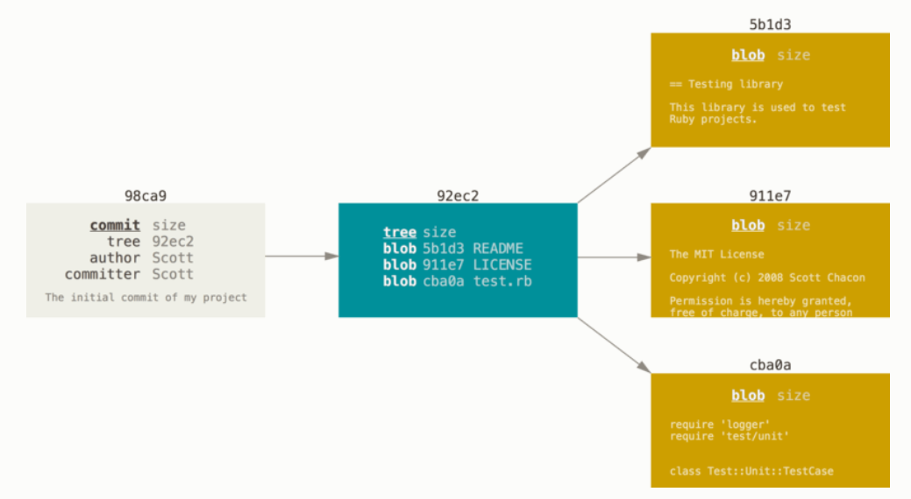
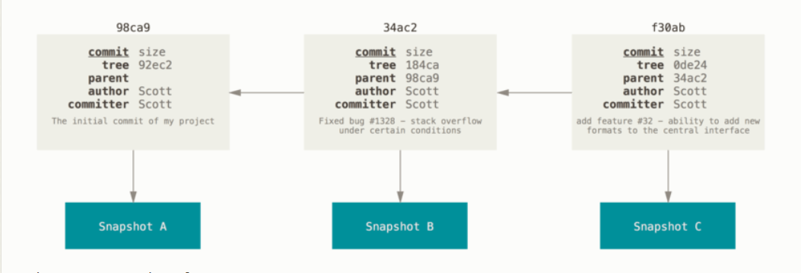
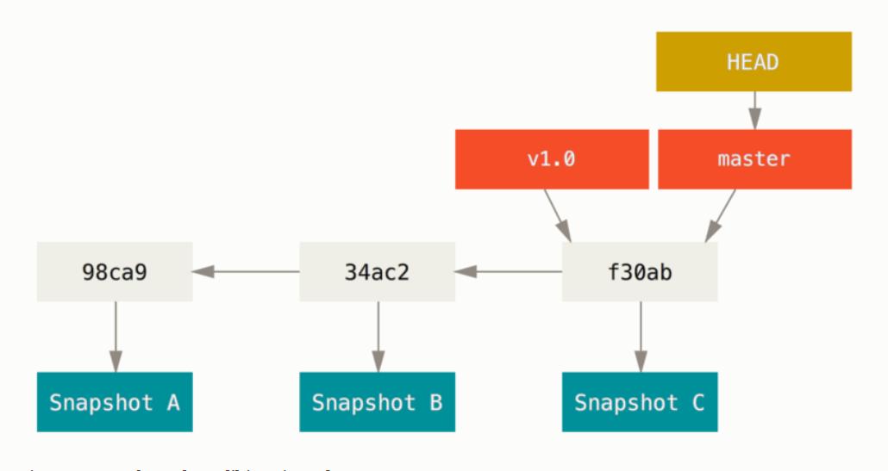
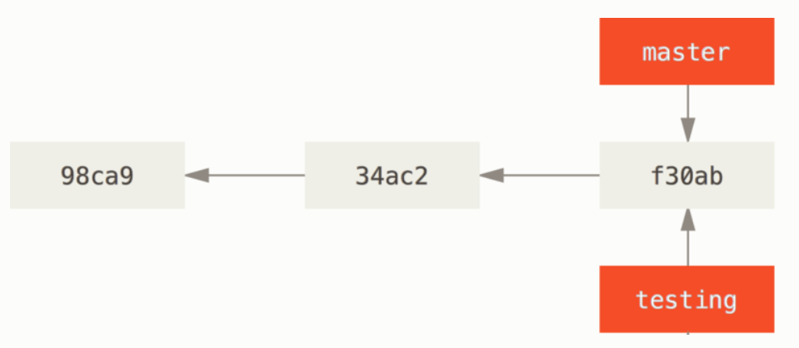
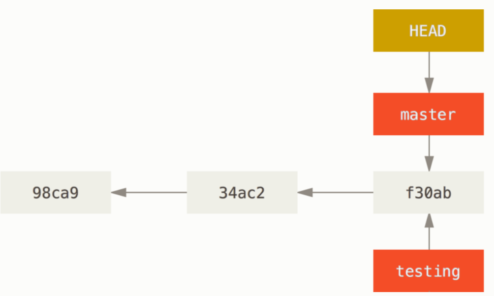
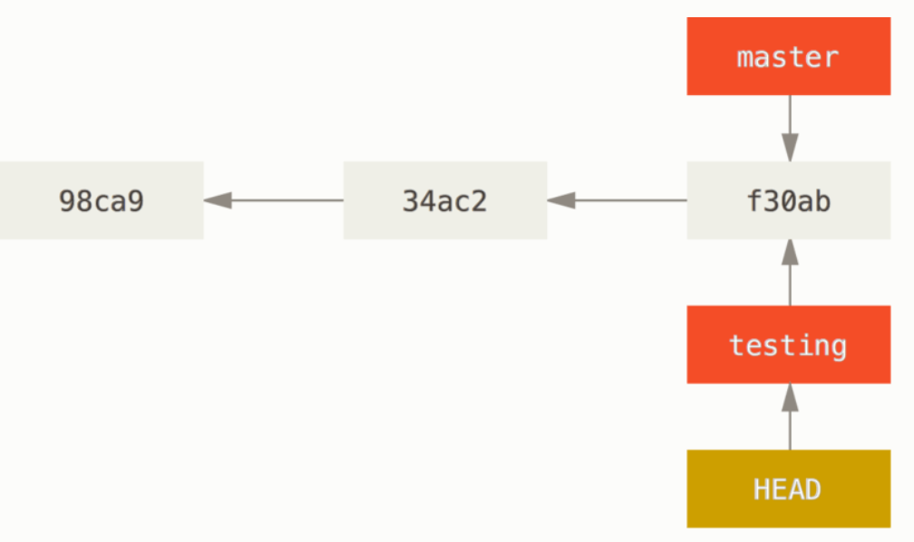
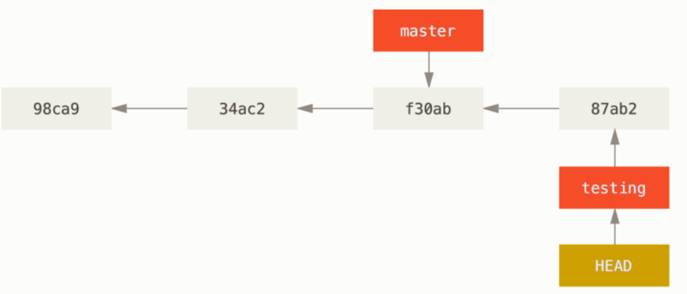
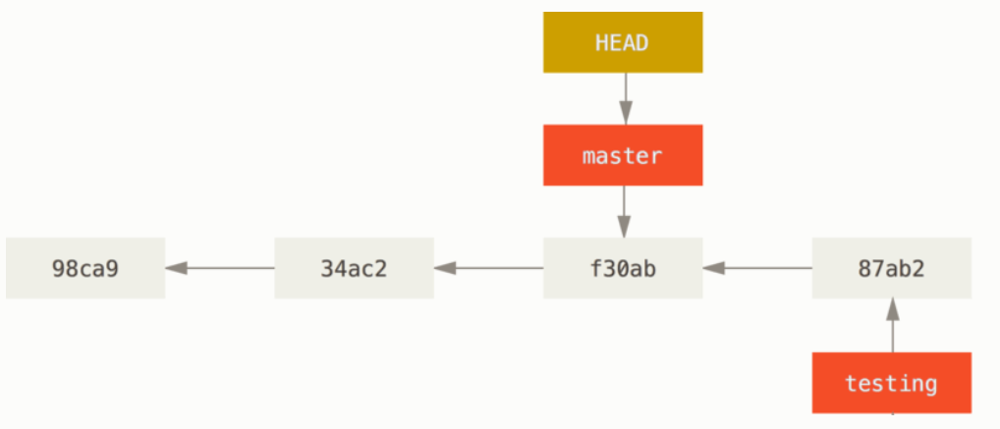
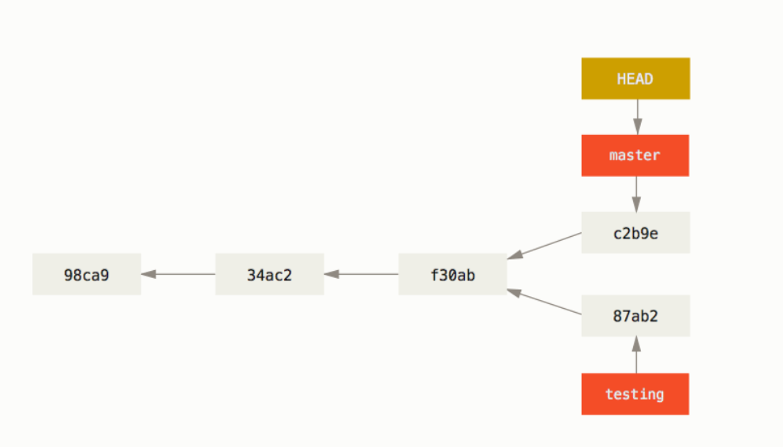

<!-- new slide -->

# 3.1 Les branches avec Git - Les branches en bref

<!-- new slide -->

## Un commit et son arbre
{:width="500px"}
  *Un commit et son arbre* 

<!-- new slide -->

## Commits et leurs parents
{:width="500px"}
  *Commits et leurs parents* 
<!-- new slide -->

## Une branche et l’historique de ses commits
{:width="500px"}
  *Une branche et l’historique de ses commits* 

<!-- new slide -->  

## Deux branches pointant vers la même série de commits
{:width="500px"}
  *Deux branches pointant vers la même série de commits* 

<!-- new slide -->

## HEAD pointant vers une branche
{:width="500px"}
  *HEAD pointant vers une branche* 

<!-- new slide -->
## HEAD pointe vers la branche courante
{:width="500px"}
  *HEAD pointe vers la branche courante*

<!-- new slide -->

## La branche HEAD avance à chaque commit
{:width="500px"}
  *La branche HEAD avance à chaque commit*

<!-- new slide -->

## La branche HEAD avance à chaque commit
{:width="500px"}
  *La branche HEAD avance à chaque commit*

<!-- new slide -->

## Divergence d’historique
{:width="500px"}
  *Divergence d’historique*
<!-- new slide -->

